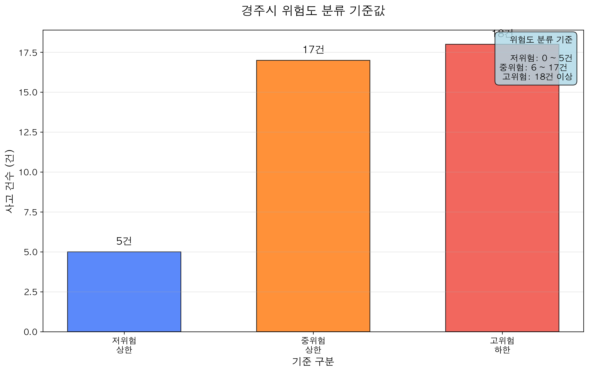
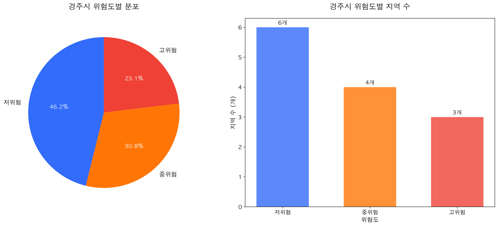
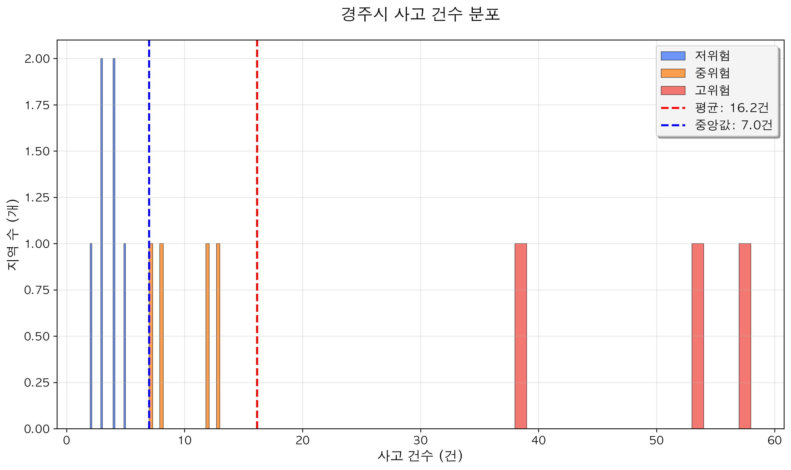
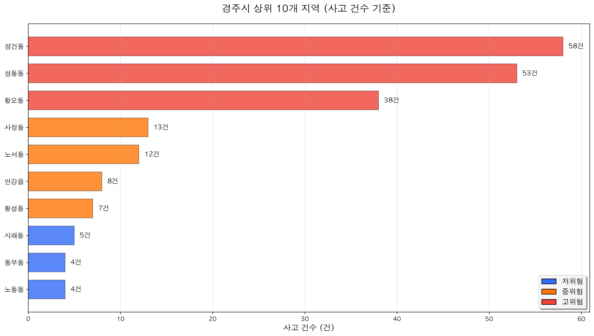

# 경주시 교통사고 위험도 분석 보고서

📅 **생성일시**: 2025년 08월 19일 16시 08분  
🔍 **분석 대상**: 경주시  
📊 **분석 방법**: RegionRiskAnalyzer (적응형 기준)

---

## 📋 요약 (Executive Summary)

경주시의 교통사고 데이터를 분석하여 지역별 위험도를 분류하였습니다. 총 **13개 지역**을 대상으로 적응형 알고리즘을 사용하여 저위험, 중위험, 고위험으로 분류하였습니다.

### 🎯 주요 결과
- **평균 사고 건수**: 16.2건
- **최대 사고 건수**: 58건
- **고위험 지역**: 3개 (23.1%)
- **중위험 지역**: 4개 (30.8%)
- **저위험 지역**: 6개 (46.2%)

---

## 📊 통계 분석

### 기본 통계
| 항목 | 값 |
|------|-----|
| 총 지역 수 | 13개 |
| 평균 사고 건수 | 16.15건 |
| 중앙값 | 7.0건 |
| 표준편차 | 19.07건 |
| 최소값 | 2건 |
| 최대값 | 58건 |

### 분위수 분석
| 분위수 | 값 |
|--------|-----|
| 1사분위 (Q1) | 4.0건 |
| 3사분위 (Q3) | 13.0건 |
| 90백분위 | 50.0건 |

---

## 🎯 위험도 분류 기준

경주시의 데이터 분포 특성을 반영하여 다음과 같은 적응형 기준을 설정하였습니다:

| 위험도 | 범위 | 지역 수 | 비율 |
|--------|------|---------|------|
| 🟢 저위험 | 2 ~ 5건 | 6개 | 46.2% |
| 🟡 중위험 | 6 ~ 17건 | 4개 | 30.8% |
| 🔴 고위험 | 18건 이상 | 3개 | 23.1% |

---

## 📈 시각화 분석

### 위험도별 분포

### 사고 건수 히스토그램

### 상위 위험 지역

---

## 🚨 고위험 지역 상세 분석

### 고위험 지역 목록

| 순위 | 지역명 | 사고건수 | EMD 코드 |
|------|--------|----------|----------|
| 1 | 성건동 | 58건 | 47130108 |
| 2 | 성동동 | 53건 | 47130104 |
| 3 | 황오동 | 38건 | 47130105 |

## ⚠️ 중위험 지역 (4개)

### 주요 중위험 지역

- **사정동**: 13건
- **노서동**: 12건
- **안강읍**: 8건
- **황성동**: 7건

---

## 💡 권장사항 및 결론

### 🎯 핵심 권장사항
1. **고위험 지역 집중 관리**: 3개 고위험 지역에 대한 집중적인 안전대책 수립
2. **중위험 지역 예방 조치**: 4개 중위험 지역의 사고 예방을 위한 선제적 조치
3. **지속적인 모니터링**: 정기적인 데이터 업데이트를 통한 위험도 재평가

### 📊 분석 방법론의 특징
- **적응형 기준**: 지역 특성을 반영한 맞춤형 위험도 기준 적용
- **통계적 근거**: 평균, 중앙값, 분위수를 종합적으로 고려한 과학적 분류
- **실용성**: 정책 결정에 활용 가능한 명확한 기준 제시

---

## 📁 첨부 자료

### 📊 차트 및 그래프
- [위험도별 분포 차트](images/risk_distribution.png)
- [사고 건수 히스토그램](images/accident_histogram.png)
- [상위 위험 지역 차트](images/top_regions.png)
- [분류 기준 차트](images/criteria_comparison.png)

### 🗺️ 인터랙티브 지도
- [교통사고 위험도 지도](interactive_map.html)

### 📄 원본 데이터
- 분석 원본 파일: `RegionRiskAnalyzer_경주시_analysis.json`

---

*본 보고서는 RegionRiskAnalyzer를 사용하여 자동 생성되었습니다.*
*분석 기준일: 2025년 08월 19일 16시 08분*
